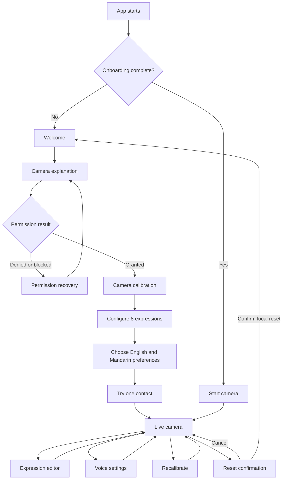

# TapTalk Interface Design Specification

Status: prototype-ready interface contract
Owner: Interface Design
Audience: Integration, Hand Tracking, App State and Storage, Robotic Voices,
and QA

This document specifies the first full-prototype interface. It intentionally
does not choose an application framework or implement tracking, validation,
speech, or persistence. The repository does not yet contain shared application
scaffolding, so the implementation handoff is expressed as screen, component,
state, and event contracts.

## Scope and fixed vocabulary

TapTalk has exactly eight expression inputs:

1. `left_index`
2. `left_middle`
3. `left_ring`
4. `left_pinky`
5. `right_index`
6. `right_middle`
7. `right_ring`
8. `right_pinky`

The words **left** and **right** always mean the user's physical hands. They do
not mean the left or right side of the screen. The camera preview is mirrored,
so the user's physical left hand normally appears on the right side of the
preview. Mirroring changes display coordinates only; it never changes a finger
identifier, label, expression, event, or voice request.

The interface has two locked local defaults: Piper
`en_US-hfc_female-medium` for English and Matcha
`matcha-icefall-zh-baker` for Mandarin.
No voice settings, system voice names, operating-system picker, custom voice
upload, or additional identity is shown.

## Experience principles

- **Visible, not memorized.** The assigned expression remains adjacent to every
  visible fingertip. A semantic-hand mapping list provides the same information
  outside the video.
- **Acknowledge before audio.** A confirmed contact changes the visual state
  immediately. The UI never waits for speech submission or playback onset.
- **One contact, one acknowledgement.** `confirmed` causes one visible and
  assistive-technology announcement. Repeated `held` snapshots do not retrigger
  it.
- **Immediate rearm after a real release.** The interface adds no cooldown after
  Hand Tracking confirms separation. The next confirmation for that finger is
  accepted immediately.
- **Every new tap restarts speech.** A new activation interrupts the phrase
  currently playing and starts the new request immediately, regardless of
  which finger produced either activation.
- **Local and explicit.** Camera and on-device configuration explanations
  appear before permission and reset actions.
- **Recover in place.** Loss of a hand, camera interruption, and audio failure
  do not discard the current assignments or create a synthetic activation.
- **Redundant feedback.** State is conveyed with text, shape/icon, and visual
  emphasis; color and motion are never the only signals.

## Information architecture

### Implemented iPhone presentation

The released desktop information architecture remains unchanged. On an
iPhone, the same application renders a sequential presentation instead:

```text
Tutorial → 8-expression setup → Camera choice → Viewport-sized live camera
```

The setup preserves all eight semantic finger labels and allows blank fields
to disable fingers. **Continue** validates, saves, and prepares the existing
English and Mandarin voices before opening a modal with distinct **Start
camera** and **Start camera + record** actions. Camera permission is not
requested before either action. Portrait centers a 16:9 live camera frame that
matches the recording output, leaving room around it for the essential session
controls. Rotation remains optional; landscape expands the live camera and
keeps recording available. Fingertip labels must remap and remain readable in
the phone's current direction. Rotation never switches to the desktop
interface. iPad remains on the desktop presentation.

While voices are still preparing, **Continue** retains a waiting appearance but
remains tappable. Tapping it opens a short explanation that English and
Mandarin are loading locally and asks the user to wait a few seconds; it must
not fail silently or appear broken.

This iPhone addendum supersedes the generic narrow-layout guidance below where
the two conflict. It changes presentation only, not gesture, voice, tracking,
storage, recording, or validation behavior.



Only user navigation is represented above. Camera, tracking, storage, and
speech errors are state changes within the current screen, not new gesture
behaviors.

## Global shell

The application shell has one primary workspace and no conventional sidebar.

- Header:
  - TapTalk wordmark or text name.
  - Camera status with visible text: `Camera on`, `Camera off`, or
    `Camera needs attention`.
  - `Edit expressions` button.
  - `Settings` button.
- Main:
  - The active onboarding, live, editor, or recovery view.
- Global assistive feedback:
  - A polite live region for confirmed activations and noncritical changes.
  - An assertive alert region reserved for permission or camera failure.
  - Focus moves only after explicit navigation or a blocking error.

On a narrow viewport the header actions may collapse into a labeled `Menu`
button. The camera status remains visible and does not become icon-only.

## Screen and state specification

### 1. Welcome

Purpose: explain TapTalk without implying sign-language recognition or general
gesture interpretation.

Required content:

- Heading: `Speak with eight fingertip contacts`
- Explanation: `Assign one short English or Mandarin expression to each
  non-thumb finger. Touch that fingertip to the thumb on the same hand to speak
  it.`
- Boundary note: `TapTalk recognizes only these eight configured contacts. It
  does not interpret sign language or other gestures.`
- Privacy note: `Camera frames are processed locally and are not stored or
  uploaded by default. Your assignments stay on this device.`
- Primary action: `Continue`

### 2. Camera explanation and permission

The browser or operating-system permission request must be initiated by the
user pressing `Allow camera`, not automatically on app load.

Required content:

- Heading: `Let TapTalk see your hands`
- Explanation of why the camera is needed.
- Local-processing and no-frame-retention statement.
- A persistent camera-status indicator.
- Primary action: `Allow camera`
- Secondary action: `Not now`, which leaves the user on an informative
  camera-off state and does not enter the live workspace.

Permission recovery states:

| State | Visible feedback | Available action |
|---|---|---|
| Prompt dismissed | `Camera access wasn’t granted.` | `Try again` |
| Permission denied | `Camera access is blocked. Enable it in your browser or device settings, then return to TapTalk.` | `Open settings` when supported; always offer `Try again` |
| No camera device | `No camera was found. Connect a camera and try again.` | `Try again` |
| Camera busy | `Another app may be using the camera.` | `Try again` |
| Unsupported camera API | `This browser cannot provide the camera TapTalk needs.` | No false retry loop; offer environment guidance supplied by Integration |

The UI consumes a permission/camera status. It does not infer permission from
tracking output.

### 3. Calibration

Purpose: help the user produce an acceptable view without owning tracking
thresholds.

```text
┌──────────────────────────────────────────────────────────────────────┐
│ Camera on                                      Set up your camera    │
├───────────────────────────────────────┬──────────────────────────────┤
│                                       │ ○ Camera image available     │
│          MIRRORED LIVE PREVIEW        │ ○ Left hand visible          │
│                                       │ ○ Right hand visible         │
│     Keep both hands inside the frame  │ ○ Position ready             │
│                                       │                              │
│                                       │ Move back / improve lighting │
├───────────────────────────────────────┴──────────────────────────────┤
│ Back                                        [Continue when ready]    │
└──────────────────────────────────────────────────────────────────────┘
```

Integration supplies the checklist labels, status, guidance, and
`canContinue` value from tracking/calibration services. The UI may render
`waiting`, `passed`, and `needs attention`; it must not calculate visibility,
confidence, distance, lighting, or timing thresholds.

If only one hand is required for the narrow proof of concept, Integration may
mark the other-hand check optional through the contract. The full-prototype
configuration requires both semantic hands and all eight mappings.

### 4. Configure expressions during onboarding

This is the same editor component used from the live screen, presented as an
onboarding step. All eight rows are visible in semantic order. No thumb row,
add-row button, delete-row action, or reorder control exists.

The `Continue` action is enabled only when the App State validation result says
all eight assignments are valid. The UI does not implement validation rules
independently.

### 5. Prepare the two voices

Voice preparation begins as soon as the page opens. The first-run guide does
not ask the user to choose or preview a voice. After the three slides, the
camera stage shows combined English/Mandarin download progress until both fixed
Piper models are ready. Only then are the camera controls enabled.

### 6. Practice

Purpose: teach the existing contact/rearm interaction before entering live
mode.

- The user selects one of the eight configured fingers from a semantic list.
- The mirrored preview identifies that physical fingertip.
- Instruction: `Touch this fingertip to the thumb on the same hand.`
- On confirmation, the assigned expression is highlighted immediately.
- While held: `Contact held — separate your finger and thumb to use it again.`
- On confirmed separation: `Ready to use again.` The UI becomes ready on that
  state update without an additional countdown or cooldown.
- Primary action after one complete contact-and-separation cycle: `Start using
  TapTalk`.
- Secondary action: `Skip practice`.

Practice consumes normal tracking states and activation events. It does not
introduce a practice-only gesture or synthesize activation.

### 7. Live camera workspace

Wide layout:

```text
┌──────────────────────────────────────────────────────────────────────────────┐
│ TapTalk   ● Camera on                  [Edit expressions] [Settings]          │
├──────────────────────────────────────────────────────┬───────────────────────┤
│ MIRRORED PREVIEW                                     │ YOUR MAPPINGS         │
│                                                      │                       │
│ screen left                         screen right     │ LEFT HAND             │
│ (physical RIGHT)                    (physical LEFT)  │ Index    Hello         │
│                                                      │ Middle   Yes           │
│   ┌───────────┐                         ┌──────────┐  │ Ring     Please wait   │
│   │ RIGHT     ├── leader       leader ─┤ LEFT     │  │ Pinky    Thank you     │
│   │ INDEX     │                         │ INDEX    │  │                       │
│   │ Thank you │                         │ Hello    │  │ RIGHT HAND            │
│   └───────────┘                         └──────────┘  │ Index    Thank you     │
│       ○ fingertip                    ●✓ fingertip    │ Middle   ...           │
│                                     CONFIRMED        │ Ring     ...           │
│                                                      │ Pinky    ...           │
├──────────────────────────────────────────────────────┴───────────────────────┤
│ Selected: Left index — “Hello”                              Voice submitted   │
└──────────────────────────────────────────────────────────────────────────────┘
```

The wireframe uses example expressions only to demonstrate layout. It does not
define defaults.

Narrow layout:

```text
┌──────────────────────────────┐
│ TapTalk   ● Camera on  [Menu]│
├──────────────────────────────┤
│                              │
│   MIRRORED LIVE PREVIEW      │
│   fingertip-adjacent labels  │
│   clamp inside this area     │
│                              │
├──────────────────────────────┤
│ Selected: Left index         │
│ “Hello”                      │
├──────────────────────────────┤
│ Your mappings          [Show]│
└──────────────────────────────┘
```

On narrow screens, the semantic mapping list starts collapsed to protect camera
space but has a visible `Show mappings` control. The list is always present in
the accessibility tree when expanded and is reachable without interacting with
the video.

Live workspace requirements:

- Video is visibly identified as mirrored.
- Camera-active text remains visible whenever frames are being acquired.
- All currently trackable non-thumb fingertips show their assigned expression.
- Thumb landmarks may receive neutral activation-control markers but never an
  expression label.
- The mapping panel is grouped by semantic `Left hand` and `Right hand`,
  independent of display position.
- A confirmed activation updates both the fingertip label and the
  `Selected` status strip.
- Speech status is secondary to selection acknowledgement. Audio failure cannot
  undo or obscure a confirmed selection.
- A newly confirmed activation is never blocked by an earlier animation,
  announcement, or audio request from any finger.
- Each simultaneously held contact retains its own state. A global animation
  must not serialize or suppress their visual activation feedback.

### 8. Expression editor

```text
┌──────────────────────────────────────────────────────────────────────────────┐
│ Edit expressions                                           [Cancel] [Save]   │
│ Each finger has one 1–5 unit expression. Languages may differ by finger.     │
│                                                                              │
│ LEFT HAND                              RIGHT HAND                            │
│ Index                                  Index                                 │
│ [Hello_______________________] 1/5    [谢谢_______________________] 2/5      │
│ Middle                                 Middle                                │
│ [Yes_________________________] 1/5    [No_________________________] 1/5      │
│ Ring                                   Ring                                  │
│ [Please wait_________________] 2/5    [请稍等_____________________] 3/5      │
│ Pinky                                  Pinky                                 │
│ [Thank you___________________] 2/5    [可以_______________________] 2/5      │
│                                                                              │
└──────────────────────────────────────────────────────────────────────────────┘
```

Editor behavior:

- Every row has a persistent semantic finger label, one short single-line
  input, and a `N/5` count supplied by App State. Language is detected
  automatically from the expression.
- The input is not a textarea and does not grow into long-form composition.
  App State revalidates it and the UI presents the returned result.
- Field-level errors appear adjacent to the field and are associated through
  the platform accessibility description mechanism.
- The first invalid field receives focus only after an attempted save, not
  while the user is typing.
- `Save` emits the complete eight-row draft and remains pending until App State
  accepts or rejects it. It does not write storage directly.
- `Cancel` requests confirmation only when the draft differs from the supplied
  saved assignments.
- A storage failure keeps the draft on screen and offers `Try saving again`.
- Voice routing follows the assignment language; no voice settings or
  per-finger voice control is added.

### 9. Settings, recalibration, and reset

Settings contains only first-prototype controls:

- `Recalibrate camera`.
- Local-data explanation.
- Destructive action: `Reset TapTalk`.

Reset confirmation:

- Heading: `Reset TapTalk?`
- Body: `This removes all eight expressions and onboarding progress stored on
  this device. Camera frames are not stored.`
- Destructive action: `Remove local configuration`
- Safe action: `Cancel`

After App State confirms reset, the interface returns to Welcome. The UI does
not claim success before the persistence owner confirms it.

### 10. Recovery within the live workspace

| Condition | Camera area | Status and action | Activation behavior |
|---|---|---|---|
| One hand temporarily lost | Keep live preview; remove anchors that no longer have current positions | `Left/Right hand not visible — place it back in the frame.` | No UI-generated event; tracking must rearm safely |
| Both hands lost | Keep live preview and framing guide | `Hands not visible — show one or both hands to continue.` | None |
| Tracking uncertain | Keep preview; mark affected mappings `Not ready` | Guidance supplied by tracking, such as repositioning | None |
| Camera interrupted | Immediately replace video with a camera-off placeholder; do not retain a last frame | `Camera stopped.` and `Restart camera` | None |
| Permission revoked | Replace video with permission recovery | Permission-specific instructions | None |
| Configuration unavailable | Replace mapping interaction with recovery | `Your expressions could not be loaded.`; `Try again`; optional reset entry | None |
| Voice playback failed | Keep camera and activation feedback running | Nonblocking `Voice could not play. Refresh to prepare the local voices again.` | Confirmed selection remains confirmed |

The duration of hand-loss tolerance, confidence thresholds, and safe
reacquisition are inputs from Hand Tracking/Product Architecture. Interface
Design does not define them.

## Fingertip label and mirrored-coordinate contract

### Required input

Hand Tracking supplies, for every visible non-thumb finger:

- Stable semantic `fingerId`.
- Current conceptual contact state.
- A current normalized fingertip point in **unmirrored camera-source
  coordinates**, where `(0, 0)` is the source frame's top-left and `(1, 1)` is
  its bottom-right.
- A normalized palm-center point for the same semantic hand when available.

The Camera Stage owns the one display transform:

```text
displayX = previewMirrored ? 1 - sourceX : sourceX
displayY = sourceY
```

The video and every overlay point use the same transform. No subsystem renames
finger IDs after this transform.

### Label placement

1. Begin along the vector from the transformed palm center through the
   transformed fingertip so the label sits beyond, rather than over, the hand.
2. Keep a small leader line or pointer ending at the exact transformed
   fingertip.
3. Clamp the full label inside the preview's safe inset.
4. Resolve overlaps by moving labels along the closest preview edge, keeping
   the leader attached. Never swap label content between anchors.
5. Prefer the full expression. If space is constrained, wrap English only at
   word boundaries and Mandarin between characters, up to the expression's
   five-unit limit.
6. When no current fingertip point exists, immediately remove both the red
   fingertip marker and its overlay label, then expose `Not visible` in the
   semantic mapping list. Do not fade or leave either element attached to a
   stale frame.

The live preview includes a persistent, concise orientation note:
`Mirrored view — labels use your physical left and right hands.`

## Contact feedback mapping

The UI consumes the contact state; it does not calculate distance or change the
state.

| Contact state | Fingertip marker | Label treatment | Visible text | Assistive announcement |
|---|---|---|---|---|
| `not_visible` | None | No overlay; mapping list muted with status icon | `Not visible` | Announce only on meaningful hand-level transition, not every frame |
| `separated` | Open circle | Neutral label | `Ready` in accessible mapping row | `Ready again` only after a preceding held state |
| `approaching` | Open circle plus inward directional cue | Emphasized outline | `Near` | None by default, avoiding noisy repeated announcements |
| `contact_candidate` | Double-ring or pending icon | Strong outline | `Checking contact` | None |
| `confirmed` | Filled circle plus check | Solid high-emphasis label | `Selected` plus expression | Once: `[Physical hand] [finger]: [expression] selected` |
| `held` | Filled circle plus held/lock icon | Remains emphasized but does not pulse repeatedly | `Separate to rearm` | Once on entry if useful; never on each snapshot |
| returned to `separated` | Open circle | Neutral label | `Ready` | Once: `[Physical hand] [finger] ready again` |

The `confirmed` visual must not depend on audio status. Animation is optional,
short, and disabled under reduced-motion preferences. The check/held shape and
visible state text remain when animation is absent.

## Rapid-repeat and audio-preemption contract

Rapid repetition uses the existing contact and separation gesture; it does not
add a new gesture:

```text
confirmed A -> held -> confirmed separation -> confirmed B
```

There is no Interface or App State cooldown between confirmed separation and
the next contact candidate. Hand Tracking still owns the minimum evidence
needed to confirm a genuine separation and prevent jitter from creating false
repeats. A sustained touch remains `held` and produces no second activation.

Robotic Voices and Integration should treat playback as one global newest-wins
lane:

- Every new activation interrupts unfinished playback and starts its phrase
  immediately, regardless of the previous and new finger IDs.
- The interrupted request is not resumed or queued.
- At most one phrase continues playing.
- Dispatch order remains the order supplied by App State. Interruption does not
  alter activation timestamps or sequence numbers.

For example, if `left_index` is assigned `slay`, three genuine taps may produce
`s`, `s`, then `slay`: taps two and three cut off the preceding playback in the
global lane, and the final request completes. Alternating between fingers
behaves the same way: every newest expression cuts off the prior one. Exact
audible cut points depend on tap cadence and speech startup latency.

The UI acknowledges all three confirmed activations immediately. It does not
wait for the earlier audio instance to report that it was interrupted.

## Language validation presentation

Validation results come from App State and Storage. The UI maps stable result
codes to concise copy and never implements a competing parser.

The editor always shows this instruction:

> Use 1–5 English words or 1–5 Chinese characters. One assignment uses one
> language. You can mix languages across different fingers, not within one
> expression.

Mandarin companion text may be shown below it without adding a UI-language
setting:

> 每个短语使用 1–5 个英文单词或 1–5 个汉字。一个手指只能使用一种语言；不同手指可以使用不同语言。

### English assignment feedback

| Result code | English feedback | Mandarin companion |
|---|---|---|
| `empty` | `Enter 1–5 English words.` | `请输入 1–5 个英文单词。` |
| `too_long` | `Use 5 English words or fewer (currently {count}).` | `最多输入 5 个英文单词（当前 {count} 个）。` |
| `contains_han` | `This English expression contains Chinese characters. Mix languages across fingers, not within one expression.` | `这个英文短语包含汉字。不同手指可以使用不同语言，但一个短语内不能混用。` |
| `mixed_script` | `Choose one language for this expression. English and Mandarin can be used on different fingers.` | `请为这个短语选择一种语言。英文和中文可以分配给不同手指。` |
| `unsupported_or_ambiguous` | `For this prototype, use English words only—without digits, emoji, or ambiguous punctuation.` | `此原型仅支持英文单词，不支持数字、表情符号或含义不明确的标点。` |
| `valid` | `{count} of 5 English words.` | `已输入 {count}/5 个英文单词。` |

### Mandarin Chinese assignment feedback

| Result code | English feedback | Mandarin companion |
|---|---|---|
| `empty` | `Enter 1–5 Chinese characters.` | `请输入 1–5 个汉字。` |
| `too_long` | `Use 5 Chinese characters or fewer (currently {count}).` | `最多输入 5 个汉字（当前 {count} 个）。` |
| `contains_latin` | `This Mandarin expression contains English letters. Mix languages across fingers, not within one expression.` | `这个中文短语包含英文字母。不同手指可以使用不同语言，但一个短语内不能混用。` |
| `mixed_script` | `Choose one language for this expression. English and Mandarin can be used on different fingers.` | `请为这个短语选择一种语言。英文和中文可以分配给不同手指。` |
| `unsupported_or_ambiguous` | `For this prototype, use Chinese characters only—without digits, emoji, or ambiguous punctuation.` | `此原型仅支持汉字，不支持数字、表情符号或含义不明确的标点。` |
| `valid` | `{count} of 5 Chinese characters.` | `已输入 {count}/5 个汉字。` |

`unsupported_or_ambiguous` reflects the current provisional product behavior.
If Product Architecture refines punctuation, digit, emoji, or script handling,
App State may add specific result codes and Interface Design should update this
copy without changing the editor structure.

## Accessible visual and interaction feedback

- The camera canvas/video and decorative overlay are one visual region with an
  accessible name and short description. Overlay labels are hidden from
  assistive technology to avoid duplication.
- A parallel semantic mapping list exposes all eight identifiers, expressions,
  languages, and current readiness states as ordinary DOM text.
- Finger order in that list is always semantic left index-to-pinky, then
  semantic right index-to-pinky. It does not follow current screen position.
- Confirmed activations enter a polite live-region queue in dispatch order.
  Announcements are event-driven, not frame-driven.
- Blocking camera/permission errors use an alert role once when the state
  changes. Persistent text remains after the announcement.
- All controls are keyboard accessible in native tab order. Focus is visibly
  indicated, and editor errors are programmatically associated with their
  inputs.
- Minimum control target size is 44 by 44 CSS pixels where the platform allows.
- Text and essential icons meet WCAG AA contrast. State is never encoded by
  hue alone; marker fill, icon, border treatment, and text change together.
- At 200% text zoom, the live workspace stacks camera, latest selection, and
  mapping list without horizontal page scrolling.
- Reduced-motion preferences remove pulsing/scale transitions without removing
  selected or held state.
- Camera guidance does not rely only on seeing an outline; it also appears as
  text.
- Voice download progress uses one named progressbar and exposes the combined
  English/Mandarin percentage to assistive technology.

## Integration-facing component contract

The following TypeScript-style definitions are framework-neutral. They name
data ownership and are not a request to add a TypeScript stack.

```ts
type FingerId =
  | "left_index"
  | "left_middle"
  | "left_ring"
  | "left_pinky"
  | "right_index"
  | "right_middle"
  | "right_ring"
  | "right_pinky";

type ExpressionLanguage = "en" | "zh-CN";

type VoiceId =
  | "en_US-hfc_female-medium"
  | "zh_matcha-baker-local";

type ContactVisualState =
  | "not_visible"
  | "separated"
  | "approaching"
  | "contact_candidate"
  | "confirmed"
  | "held";

type ValidationCode =
  | "empty"
  | "too_long"
  | "contains_han"
  | "contains_latin"
  | "mixed_script"
  | "unsupported_or_ambiguous"
  | "valid";

type CameraState =
  | "off"
  | "requesting_permission"
  | "starting"
  | "active"
  | "interrupted"
  | "no_device"
  | "busy"
  | "unsupported"
  | "error";

type PermissionState =
  | "unknown"
  | "prompt"
  | "granted"
  | "denied"
  | "blocked";

interface NormalizedPoint {
  /** Unmirrored source coordinate, inclusive range 0...1. */
  x: number;
  y: number;
}

interface ExpressionAssignment {
  fingerId: FingerId;
  language: ExpressionLanguage;
  text: string;
}

interface AssignmentDraft extends ExpressionAssignment {
  validationCode: ValidationCode;
  unitCount: number;
  messageParameters?: Readonly<Record<string, string | number>>;
}

interface FingerPresentation {
  fingerId: FingerId;
  contactState: ContactVisualState;
  sourceFingertip?: NormalizedPoint;
  sourcePalmCenter?: NormalizedPoint;
}

interface TrackingPresentation {
  /** Semantic IDs remain unchanged regardless of this display preference. */
  previewMirrored: true;
  fingers: Readonly<Record<FingerId, FingerPresentation>>;
  leftHandStatus: "not_visible" | "acquiring" | "ready" | "uncertain";
  rightHandStatus: "not_visible" | "acquiring" | "ready" | "uncertain";
  guidance?: string;
}

interface ActivationPresentation {
  activationId: string;
  fingerId: FingerId;
  expressionSnapshot: string;
  language: ExpressionLanguage;
  confirmedAtMonotonicMs: number;
  dispatchSequence: number;
  audioState:
    | "not_submitted"
    | "submitted"
    | "started"
    | "interrupted"
    | "failed";
  /** Present on an older request after any newer activation preempts it. */
  interruptedByActivationId?: string;
}

interface CalibrationCheck {
  id: string;
  label: string;
  state: "waiting" | "passed" | "needs_attention";
  guidance?: string;
  required: boolean;
}

interface InterfaceModel {
  route:
    | "welcome"
    | "camera_permission"
    | "calibration"
    | "expressions"
    | "practice"
    | "live"
    | "settings";
  permission: PermissionState;
  camera: CameraState;
  tracking?: TrackingPresentation;
  assignments: Readonly<Record<FingerId, ExpressionAssignment>>;
  drafts?: Readonly<Record<FingerId, AssignmentDraft>>;
  latestActivations: readonly ActivationPresentation[];
  calibrationChecks: readonly CalibrationCheck[];
  canContinueCalibration: boolean;
  saveState: "idle" | "saving" | "failed";
  saveError?: string;
}
```

The `assignments`, `drafts`, and `fingers` records must contain each of the eight
fixed keys exactly once at subsystem boundaries. Integration should assert this
in development and test fixtures.

### Render components

| Component | Required input | Output/intent | Must not own |
|---|---|---|---|
| `AppShell` | route, camera status | navigate intents | Routing persistence |
| `CameraPermissionView` | permission and camera state | request camera, retry, open settings, defer | Permission inference |
| `CalibrationView` | live stream handle, checks, `canContinue` | continue, back | Tracking thresholds |
| `CameraStage` | live stream handle, mirrored flag, tracking presentation, assignments, activations | optional select-mapping intent | Landmark/contact derivation |
| `FingertipLabelLayer` | transformed points, states, expression snapshot | None | Finger identity changes |
| `SemanticMappingList` | assignments and finger states | select mapping for editing/practice | Tracking |
| `LatestSelectionStatus` | activation events | None | Dispatch order or speech |
| `ExpressionEditor` | eight drafts and save state | change draft, save full draft, cancel | Validation and persistence |
| `RecoveryPanel` | normalized error state and supplied guidance | retry/reopen settings/reset request | Camera or storage recovery logic |
| `ResetDialog` | open/pending/error | confirm reset, cancel | Data deletion |

### UI intents

```ts
type InterfaceIntent =
  | { type: "camera.request" }
  | { type: "camera.retry" }
  | { type: "camera.openSettings" }
  | { type: "calibration.continue" }
  | { type: "calibration.restart" }
  | {
      type: "assignments.draftChanged";
      fingerId: FingerId;
      language: ExpressionLanguage;
      text: string;
    }
  | {
      type: "assignments.saveRequested";
      assignments: readonly ExpressionAssignment[];
    }
  | { type: "onboarding.practiceSkipped" }
  | { type: "onboarding.completed" }
  | { type: "configuration.resetRequested" }
  | { type: "configuration.resetConfirmed" };
```

Constraints on intent handling:

- The UI emits `assignments.draftChanged`; App State returns counts and
  validation codes.
- The UI emits one complete save request; App State atomically accepts or
  rejects it and owns local persistence.
- The UI never emits an activation based on pointer/touch interaction with a
  fingertip label.
- The UI renders activation events in the supplied
  `(confirmedAtMonotonicMs, dispatchSequence)` order and never invents a
  simultaneous-contact tie-break.
- A returned `separated` state unlocks the next activation immediately; the UI
  has no debounce, animation lock, announcement lock, or audio-completion lock.
- `audioState: "interrupted"` is informational. It must not replace the newest
  selected-expression feedback with an error.

## Visual-system guidance

Framework tokens may vary, but implementations must provide semantic tokens
for:

- Camera active, ready, approaching, confirmed, held, unavailable, warning,
  and error.
- Surface, text, secondary text, focus ring, and overlay scrim.
- High-contrast equivalents.

Use one consistent marker grammar:

- Open marker: separated/ready.
- Inward or double ring: approaching/candidate.
- Filled marker plus check: confirmed.
- Filled marker plus held/lock icon: held.
- Dashed or crossed status icon in the mapping list: unavailable.

Do not place translucent low-contrast text directly on arbitrary video. Every
fingertip label needs an adaptive, sufficiently opaque text backing and leader
line with contrast against both bright and dark frames.

## Acceptance walkthrough

Integration can use this UI-level walkthrough with stubbed subsystem inputs:

1. Start with no saved configuration. Welcome states the eight-contact scope,
   sign-language boundary, and local privacy behavior.
2. Continue to permission. Verify the browser prompt occurs only after
   `Allow camera`.
3. Feed each denied/interrupted state and verify a persistent explanation and
   recovery action.
4. Supply calibration checks. Verify Continue is controlled only by
   `canContinueCalibration`.
5. Supply eight drafts with mixed English and Mandarin across different
   fingers. Verify all eight fixed rows and only two language choices.
6. Feed every validation code for both languages. Verify inline bilingual
   feedback and accessible association.
7. Verify no voice-choice section is rendered and English/Mandarin route to
   their locked defaults.
8. Enter the live screen with mirrored preview coordinates. Confirm
   `left_index` appears at the mirrored location but remains labeled
   `Left index`.
9. Transition one finger through separated, approaching, candidate, confirmed,
   held, and separated. Verify exactly one selected announcement and no held
   retrigger.
10. Assign one-unit expressions such as `slay` and `serve` to two fingers.
    Deliver genuine contact/separation/contact cycles 500 ms apart. Verify
    every confirmation renders, no UI cooldown is added, and both short words
    are intelligible and finish inside their respective half-second beats.
11. Activate a different finger while the rapid-repeat audio is playing. Verify
    that the different-finger expression immediately interrupts and replaces
    the current phrase. Repeat with a longer expression to verify it is cut off
    rather than queued.
12. Remove and reacquire a hand. Verify stale labels disappear and the UI emits
    no activation.
13. Fail speech playback. Verify the selected expression remains visible and
    the camera flow continues.
14. Zoom text to 200%, enable reduced motion, navigate by keyboard, and inspect
    the semantic mapping list with a screen reader.
15. Confirm reset copy names all local configuration removed, then verify the
    UI returns to Welcome only after reset success.

## Boundary verification

| Product boundary | Interface enforcement |
|---|---|
| Exactly eight non-thumb inputs | Fixed `FingerId` union, fixed editor rows, no add/delete/reorder |
| Thumbs are activation controls only | No thumb assignment row or thumb expression label |
| One expression per finger | One language/text pair for every `FingerId` |
| One to five units | App State result rendered as `N/5`; invalid drafts cannot be saved |
| English and Mandarin only | Editor offers only `en` and `zh-CN` |
| One language per expression | Mixed-script errors; cross-finger mixing explicitly explained |
| One locked voice per language | No voice controls; language alone determines routing |
| Synthetic, non-character voices | User-facing names say robot; no protected character references |
| No system voice catalogue | No engine/system picker contract |
| No sign-language recognition | Welcome boundary copy |
| No arbitrary gesture/intent prediction | Only supplied same-hand contact states drive feedback |
| Configuration stays on device | Permission/settings/reset copy; persistence delegated locally |
| Mirroring preserves semantics | One coordinate transform; IDs and semantic list never swap |
| One sustained touch activates once | Announce only `confirmed`; `held` never retriggers |
| Separation rearms | The first confirmed separation unlocks the next activation with no UI cooldown |
| First-confirmed-first-served | UI consumes supplied timestamp and dispatch sequence |
| Global newest-tap playback | Every new activation interrupts the current phrase, regardless of finger; nothing queues |
| Rapid same-finger repetition | Confirmed separation has no added UI/audio cooldown, and each new tap restarts speech |
| Natural-speed rapid taps | Every newer tap interrupts unfinished 1× speech and starts the locked voice for its language |
| Visible feedback precedes audio | Confirmation renders independently of audio state |
| Camera frames local and not retained | Permission copy; interrupted view removes last frame |
| Camera active is visible | Persistent text status in shell |
| Reset removes stored configuration | Explicit destructive confirmation delegated to App State |

## Assumptions and unresolved questions

Assumptions used for this specification:

- English and Mandarin use their locked language voices with no user setting.
- Ambiguous punctuation, digits, emoji, and script input is rejected and mapped
  to `unsupported_or_ambiguous`.
- Hand Tracking can supply semantic IDs, conceptual states, unmirrored
  normalized fingertip coordinates, and palm centers.
- Integration can provide a live stream handle without exposing stored frames
  to UI components.
- Every voice request uses global newest-wins preemption, regardless of
  semantic finger.

Questions requiring Product Architecture or Integration resolution before
interface freeze:

1. Confirm the final simultaneous-contact finger-ID tie-break and expose only
   the resulting `dispatchSequence` to the UI.
2. Confirm the final punctuation, digit, emoji, whitespace, and ambiguous-script
   policy and validation codes.
3. Define tracking confidence, confirmation, separation, and hand-loss recovery
   timing. Separation confirmation should be as short as jitter tolerance
   safely permits; the UI adds no further delay.
4. Provide product-approved starter expressions, if onboarding needs defaults.
   The wireframes' example expressions must not become defaults accidentally.
5. Confirm whether the first prototype localizes all interface chrome. This
   specification provides bilingual validation companions but does not add a
   third language setting beyond the two spoken-expression languages.

Product Architecture is asked to record the global newest-wins audio policy
explicitly. It preserves the requirement that a true separation must occur
before the same finger reactivates, while a confirmation from any other finger
may interrupt the current phrase immediately.
